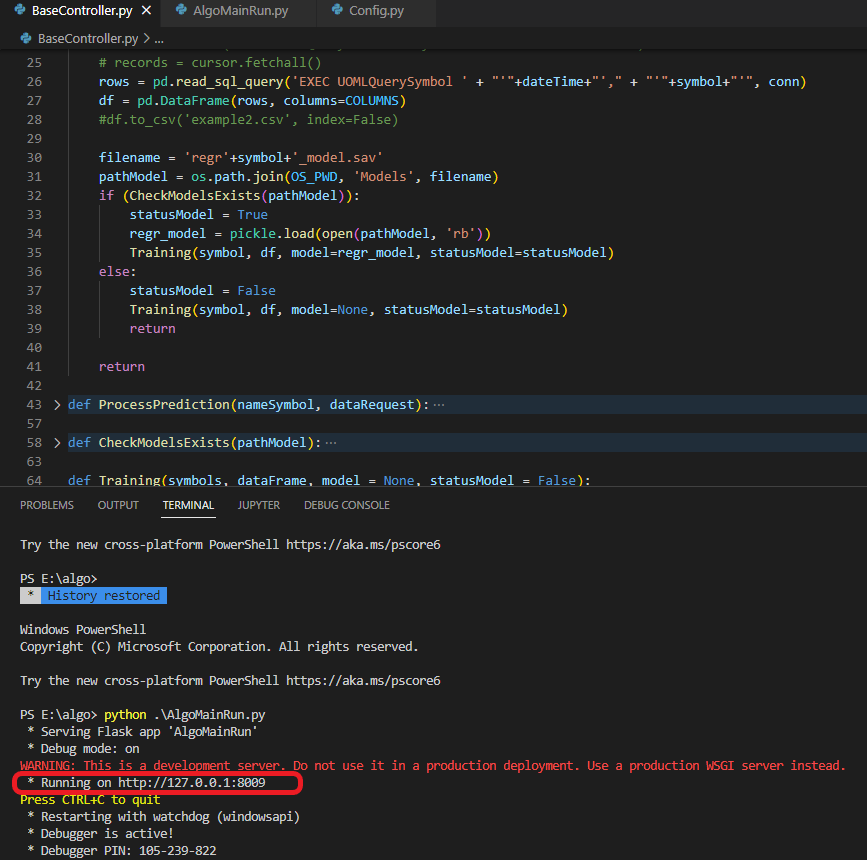

# AlgoML

* **Python** >= 3.7.9
* In reporsitory please run command: `pip install -r requirements.txt` to install libraries modules for project
* You can edit or custom the `HOST`, `PORT` and `CONNECTION_STRING` of **Flask API** in file `Config.py`

  

* To run project please run: `python .\AlgoMainRun.py`

  

* **Example run with Postman**
